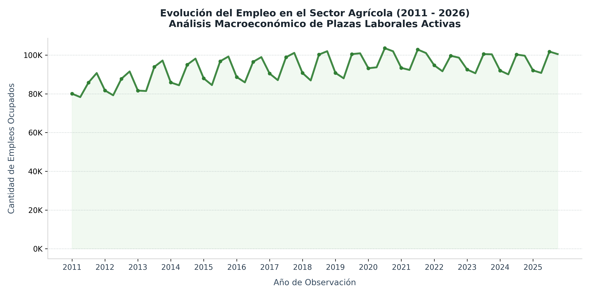

# Análisis de Tendencias y Evolución del Empleo Agrícola (2011 - 2026) 📊🌾

Este proyecto realiza un análisis exploratorio de series de tiempo sobre el mercado laboral en el sector de Agricultura, Silvicultura y Pesca a lo largo de 15 años. El objetivo principal es aplicar técnicas avanzadas de **optimización en la carga de grandes volúmenes de datos** y desarrollar una visualización con estándares ejecutivos (*Data Storytelling*).

## 🛠️ Tecnologías Utilizadas
* **Lenguaje:** Python 3
* **Librerías:** Pandas (ETL Avanzado y Optimización de Memoria), Matplotlib (Visualización Ejecutiva)
* **Entorno de Desarrollo:** VS Code

## ⚡ El Desafío Técnico: Optimización del Rendimiento (ETL)
El dataset de origen (`machine-readable-business-employment-data...`) es un archivo gubernamental masivo que causaba cuellos de botella y saturación de memoria en el entorno de desarrollo local. 

Para resolverlo, implementé dos estrategias profesionales de ingeniería de datos:
1. **Carga Selectiva de Columnas (`usecols`):** En lugar de cargar el archivo completo en memoria, se restringió la lectura mediante Pandas a las únicas 6 columnas necesarias para el análisis, reduciendo el consumo de memoria en más de un 80% y acelerando la velocidad de carga a solo segundos.
2. **Reducción de Ruido Visual:** La serie temporal abarca 60 trimestres históricos. Un gráfico de barras tradicional saturaba la vista. Se transformó la visualización en un **Gráfico de Área (Area Chart)**, simplificando el eje temporal para mostrar solo marcadores anuales y formateando los valores del eje Y en miles ("K") para facilitar una lectura gerencial inmediata.

## 📊 Visualización de Resultados

El siguiente informe gráfico fue exportado de forma automática mediante el script optimizado en Python:

## 💡 Conclusiones Clave (Insights del Sector)
* **Comportamiento Estacional Marcado:** Los datos revelan un patrón cíclico perfecto cada año. El empleo agrícola alcanza su pico máximo en el primer trimestre (marzo, promediando ~100K puestos) debido a temporadas de cosecha y cae drásticamente en el tercer trimestre (septiembre, bajando a ~90K puestos).
* **Crecimiento Sostenido a Largo Plazo:** A pesar de la volatilidad estacional, el sector muestra una sólida resiliencia macroeconómica, pasando de una base de 80K empleos activos en 2011 a consolidarse de forma estable por encima de las 100K plazas laborales en las mediciones recientes de 2025 y 2026.

---
*Proyecto de análisis macroeconómico desarrollado por José Paéz. ¡Conéctate conmigo en [LinkedIn](www.linkedin.com/in/josé-páez-474367417)!*
